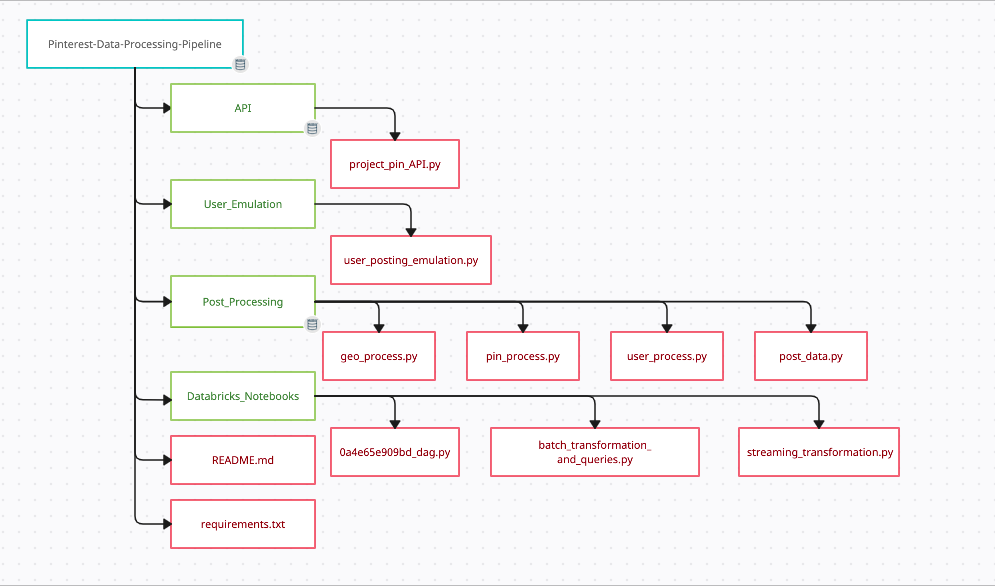
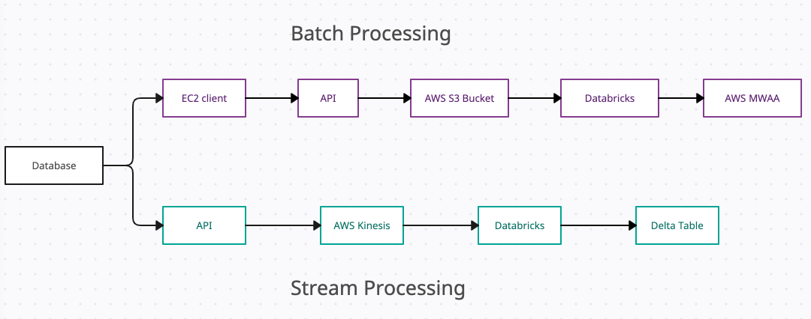

# Pinterest Data Processing Pipeline
## Overview
Pinterest Data Processing Pipeline is an AWS project which uses MSK and S3 to perform batch processes and Kinesis to perform streaming processes. In this project I have completed a data processing pipeline using AWS and Databricks which connects to a user_posting_emulation to emulate a pinterest feed.
The project is divided into 4 main directories - API, User_Emulation, Post_Processing and Databricks_Notebooks. This file structure is shown in the image below. 

The API directory contins project_pin_API.py which runs the API that the user_posting_emulation connects to.

The User_Emulation directory contains user_posting_emulation.py which runs an emulation of a pinterest feed, posting a random row of data from the table pinterest_data which includes pin data, golocation data and user data. During the while loop this file also sends the data to the batch and streaming processes.

The Post_Processing directory contains 4 files:
- geo_process.py
- pin_process.py
- user_process.py
- post_data.py

The first 3 listed, process the records to be sent to the API, this includes creating a payload and sending batch and streaming requests. 

The post_data.py file sends all of the above requests to the API.

The Databricks_Notebooks directory contains:
- 0a4e65e909bd_dag.py 
- batch_transformation_and_queries.py
- streaming_transformation.py

These are all notebooks to be run in Databricks. 

0a4e65e909bd_dag.py is a DAG which sets batch_transformation_and_queries.py to be run in the MWAA environment on AWS hourly.

The batch_transformation_and_queries.py file ingests and transforms the batch data from the S3 bucket and performs queries on the data.

streaming_transformation.py ingests and transforms the streaming data, and writes the streaming data to Delta Tables in Databricks. 




## To Run

- Install Python (3.8.5)
- Install dependencies in **requirements.txt** using pip 
- In command line, from project directory **API**, execute:
```
python3 project_pin_API.py
```
- Copy the key-pair associated with the EC2 instance into a file named 0a4e65e909bd-key-pair.pem and set permissions to read only by executing:
```
chmod 400 0a4e65e909bd-key-pair.pem
```
- In another command tab, to connect to the EC2 instance and start the confluent server, run:
```
ssh -i 0a4e65e909bd-key-pair.pem ec2-user@ec2-54-86-149-29.compute-1.amazonaws.com
```
```
export CLASSPATH=/home/ec2-user/kafka_2.12-2.6.2/libs/aws-msk-iam-auth-1.1.5-all.jar
```
```
cd confluent-7.2.0/bin/
```
```
./kafka-rest-start /home/ec2-user/confluent-7.2.0/etc/kafka-rest/kafka-rest.properties
```

- In a separate command window, from the **User_Emulation** directory, execute:
```
python3 user_posting_emulation.py
```
## Project Outline

### Milestone 1 & 2
I set up my AWS account and downloaded the pinterest posting structure. This included the API to connect to the pinterest_database and the posting emulation, which at that time just took rows from the pinterest_database and posted them on the command line. 

### Milestone 3
This was the start of the batch processing pipeline. I created my key-pair.pem file to connect to the EC2 instance in my AWS account. I then set up Kafka on the EC2 instance and installed the IAM MSK authentication package, and made a client.properties file to configure the Kafka client to use IAM authentication.

During this milestone I also created my Kafka topics 0a4e65e909bd.pin, 0a4e65e909bd.geo and 0a4e65e909bd.user.

### Milestone 4

I connected my MSK cluster to the S3 bucket using my EC2 client. To do this I created a custom plugin and connector using MSK connect.

### Milestone 5

I then configured an API to send data to the MSK Connector through a REST Proxy integration. To do this I installed the Confluent package on the EC2 client and modified the kafka-rest.properties file to allow the REST proxy to perform IAM authentication. Using the API invoke URL I modified the user_posting_emulation to send the data through to the 3 created topics. 

### Milestones 6 & 7

These milestones were to set up my Databricks account, ingest the information stored in the topics, clean the data and perform queries.

In Databricks I created the notebook: batch_transformation_and_queries, which mounts the S3 bucket to the account, cleans the dataframes, ensureing the information is the correct datatype, that any empty entries return Null and some merging and dropping transformations - creating username column for the user_df and the coordinates column for the geo_db.

I then performed some queries on the data, such as wroking out the most popular category each year, and the median follower count for different age groups. 

### Milestone 8

I set up a Directed Acyclic Graph (DAG) to automate the workbook I have created to process the batch information every hour using AWS Managed Apache Airflow (MWAA). This is another Databricks Notebook which is run through AWS MWAA. Through using the Airflow UI I can start the DAG which will connect to the Databricks batch_transformation_and_queries workbook.

### Milestone 9

I set up AWS Kinesis Data Streams to create a continual Streaming process for the data. To do this I first created my streams in AWS Kinesis. 

I then configured the API for Kinesis integration creating methods and resources to enable the API to:
- List the streams
- Create, describe and delete streams 
- Add records to streams

Next I edited the user_post_emulation to include sending the stream information through to their corresponding streams. 

Next, I created the function create_dataframe_from_stream_data() which takes the readStream() method in Spark which connects to the Kinesis stream and creates a dataframe for the information to be displayed.
I performed the same transformations on the data as I did with the batch data and then saves each stream in a Databricks Delta Table.

