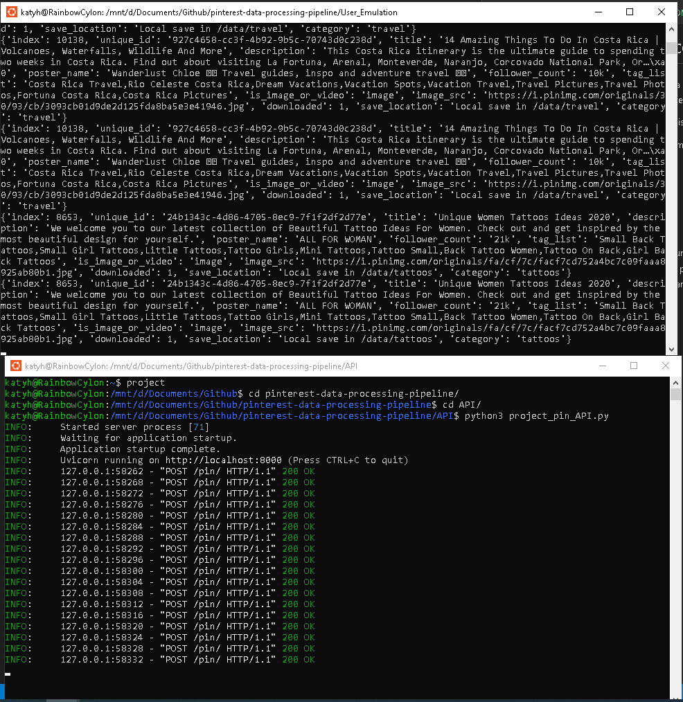
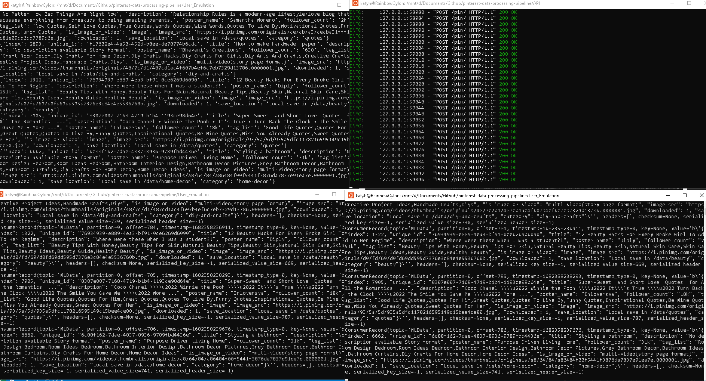

# Pinterest Data Processing Pipeline
In this project I have completed a data processing pipeline for use with Pinterest. This includes a batch processing layer and a streaming processing layer.

The batch layer will collect and store historical data in the system.

The streaming layer will allow a real-time data flow, collecting and storing recent data to the system. 

**Technologies used:**
- Python
- Kafka

## Milestone 3
This milestone was based around ensuring the prewritten code was working correctly. The pre-written code contains an API which listens for post requests on a local server, and a user posting emulation, which takes information from a table and posts it to the local server, emulating a user on pinterest.

*User posting emulation (top), and API (bottom)*

## Milestone 4
I then created a Kafka topic for my information to be stored within the system and updated the user_posting_emulation.py file to send the data which was posted through to the topic. I then produced the consumers for my pipelines, one for the batch pipeline and one for the streaming pipeline. This was then all tested to ensure it was working as it should. 

*Systems from Milestone 3 along with the consumers produced for the 2 pipelines*